# NSD: An R package for nonparametric statistical downscaling

NSD is an R package for fusing datasets of different spatiotemporal support using nonparametric statistical downscaling, with:

* **Response dataset:** Low resolution dataset that is assumed to be accurate within measurement error, e.g. in situ samples collected at a small number of point locations at some point times.
* **Covariate dataset:** Higher resolution dataset providing more information on spatiotemporal patterns of a variable, but that requires calibration, e.g. satellite remote sensing data on a dense grid cell scale, averaged over each month.

NSD allows fusing these datasets to retain the spatiotemporal information from the covariate dataset, with the accuracy of the response dataset.

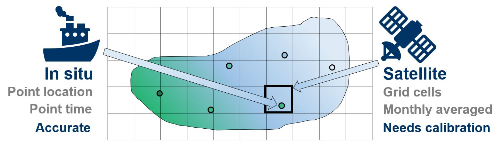

*Figure 1:* Example application of NSD to fuse in situ (response) and satellite (covariate) water quality datasets.

**NEW** in NSD version 0.0.0.9001: Fusing of a response and two covariates is allowed using the function `run.NSDmodelMulti`.

# Data required:

To use the package, you need at least:

* Response dataset: either a matrix or data frame with *q* rows representing times of data collection and *n* columns representing point locations of data collection. Missing values are allowed.
* Covariate dataset: matrix or data frame with *p* rows representing times (or mid points of temporal average intervals) and *n* columns representing the grid cell centres that each response point lies within. Missing values are allowed.
* A matrix of coordinates of response data locations.
* A matrix of coordinates at which to predict.

Note that the response and covariate datasets can also be provided in the form of lists, both of length *n*, where each item in each list is a numeric vector of data values for that location (each potentially of different lengths, depending on when data are available for each location). Missing values should be avoided in the case where the datasets are provided as lists.

It is highly recommended to also provide the times at which data are collected, either in the form of Date vectors (or numeric vectors, e.g. in the form year.proportionOfYear) of length *q* for the response data and of length *p* for the covariate data (where *q* and *p* might be the same), or in the form of a lists of length *n* where each member is a Date vector (or numeric vector) of length equal to the corresponding data provided as a list too.

# Choices required:

## Basis type and dimension

There are lots of adjustments to the default behaviour that can be made, but the biggest choices are the basis type and dimension. NSD fuses the data by treating data at each location as observations of smooth functions, accomplished by using basis functions. The default is to use B-spline bases of dimension 5 for the data at each location, but a more appropriate choice can usually be made from either prior knowledge of the processes at work, or by plotting the response or covariate data over time. Note that the same basis type and dimension must be used for both the response and covariate data.

## Spatial decay parameters

The spatial aspect of the data fusion is accomplished through spatially varying coefficients regression, using an exponential spatial covariance for the spatially varying intercept and slope parameters. The spatial decay parameters of the exponential spatial covariance therefore must be chosen. These are both set as 0.1 by default, but a more appropriate choice can usually be made.

Both the basis dimension and spatial decay parameter choices can be made via a cross validation process, or similar.

## MCMC iterations

The final main choice to make relates to the MCMC process used to fit the Bayesian hierarchical model of NSD. By default, the number of chains is 2, with a short burn-in, some thinning and a small number of MCMC iterations. The iterations should be increased until the chains appear to reach convergence to a stationary distribution according to diagnostic checks.

# Simple example

Let us work through a simple example using water quality data provided by the package.

## Data read-in and manipulation:

```{r init1}
library(NSD)

data("ISdata")
data("RSdata")
data("coords.IS")
data("coords.RS")
data("months.balaton")

class(ISdata); dim(ISdata)
class(RSdata); dim(RSdata)
class(coords.IS); dim(coords.IS)
class(coords.RS); dim(coords.RS)
class(months.balaton); length(months.balaton)
```

`ISdata` is the 115 by 9 matrix of response data, which is a dataset of in situ water quality data collected at 9 point locations over 115 months. `RSdata` is the 115 by 7616 matrix of covariate data, which is a dataset of satellite data for the same variable, collected over the same 115 months, for 7616 grid cells covering the entire lake. `coords.IS` and `coords.RS` are the 9 by 2 and 7616 by 2 matrices of coordinates of in situ and satellite data, respectively. `months.balaton` is the 115-length Date vector of dates at the centre of each month. (In this case, the response and covariate data have the same times of data collection, but this need not be the case to use the NSD package.)

We need to know which satellite grid cells each in situ point location lies within. Let us calculate this using the `sp::spDistsN1` function:

```{r spDists}
which.closest <- numeric(nrow(coords.IS))
for(i in 1:nrow(coords.IS)){
  which.closest[i] <- which.min(sp::spDistsN1(coords.RS, coords.IS[i, ]))
}
which.closest
```

## Plots of the data

Let us produce some simple plots of the data. We can first examine the spatial extent of the data and check that we have calculated the closest grid cells to each point location correctly:

```{r plots1, fig.width=7, fig.height=3.25}
par(mar=c(4,4.5,1,0.5))
plot(coords.RS, pch = 15, cex = 0.25, col = "grey", xlab = "Longitude (degrees East)", 
     ylab = "Latitude (degrees North)", bty = "n")
points(coords.IS, pch = 16, col = "dodgerblue")
points(coords.RS[which.closest, ], pch = 4, col = "red")
legend("topleft", legend = c("Satellite grid cell centres", "In situ point locations", 
                             "Closest grid cells to point locations"), pch = c(15, 16, 4), 
       pt.cex = c(0.25, 1, 1), col = c("grey", "dodgerblue", "red"), bty = "n")
```
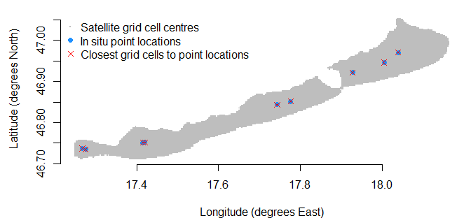

Let us plot the data over time for a single in situ point location and the satellite data for its corresponding grid cell:

```{r plots2, fig.width=7, fig.height=3.5}
par(mar=c(4,4.5,1,0.5))
plot(ISdata[, 6] ~ months.balaton, type = "o", pch = 16, col = "grey", xlab = "Year", 
     ylab = "Data value", ylim = c(min(c(ISdata[, 6], RSdata[, which.closest[6]]), 
                                       na.rm = TRUE), 
                                   max(c(ISdata[, 6], RSdata[, which.closest[6]]), 
                                       na.rm = TRUE)), bty = "n")
lines(RSdata[, which.closest[6]] ~ months.balaton, pch = 15, col= "deepskyblue", lty = 2)
legend("topright", legend = c("In situ data", "Satellite data"), pch = c(16, NA), 
       lty = c(1, 2), col = c("grey", "deepskyblue"), horiz = TRUE, bty = "n")
```
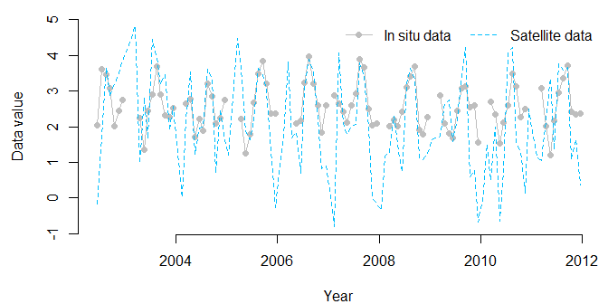

There are clear patterns of 2 peaks per year in both datasets, but there is much higher variability in the satellite data, showing the need for calibration with the in situ data.

Let us plot the data over space for a single time point. Adding the in situ data last in the data frame below means that they are plotted last, over the satellite data, allowing us to compare the in situ data to their surrounding satellite data:

```{r plots3, fig.width=7, fig.height=4}
data.spatial.month102 <- cbind.data.frame(lon = c(coords.RS[, 1], coords.IS[, 1]),
                                        lat = c(coords.RS[, 2], coords.IS[, 2]),
                                        data = c(RSdata[102, ], ISdata[102, ]))
sp::coordinates(data.spatial.month102) <- c("lon", "lat")
locations.insitu <- cbind.data.frame(lon = coords.IS[, 1], lat = coords.IS[, 2])
sp::coordinates(locations.insitu) <- c("lon", "lat")
sp::spplot(data.spatial.month102, colorkey = TRUE, pch = 16, 
           cex=c(rep(0.5, 7616), rep(1, 9)), col.regions = rev(viridis::viridis(100)), 
           sp.layout = list("sp.points", locations.insitu, pch = 1, 
                            col = "white", cex = 1.25), scales = list(draw = TRUE), 
           xlab = "Longitude (degrees East)", ylab = "Latitude (degrees North)")
```
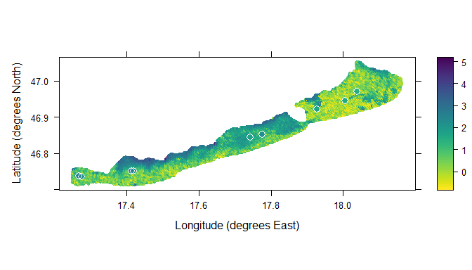

The in situ data locations are shown surrounded by white circles. The spatial patterns of the satellite data are clear and would not be understood from the in situ data alone, but the in situ data are clearly slightly higher than their nearby satellite data cells on average, showing the need for calibration.

Let us now fit the model and fuse the datasets.

## Fitting the nonparametric statistical downscaling model

We have the response dataset `ISdata`, the covariate dataset `RSdata`, the matrix of data locations `coords.IS` and the vector `which.closest` that tells us which grid cell each response point location lies within. We also have the vector of dates of data collection `months.balaton`. A simple example is to fit the model to data for all locations except in situ location 6 and then predict at that location for the same times as the data. Let us select a B-spline basis of dimension 41 and let us increase the number of MCMC iterations from the default 100 to 10,000:

```{r model1}
model1 <- run.NSDmodel(nIter = 10000, yData = ISdata[, -6], xData = RSdata[, which.closest[-6]],
                       xPred = RSdata[, which.closest[6]], coordsData = coords.IS[-6, ],
                       coordsPred = coords.IS[6, ], times.yData = months.balaton, 
                       times.xData = months.balaton, times.xPred = months.balaton,
                       times.yPred = months.balaton, basis.type = "bspline", basis.dim = 41)
```

We should check for convergence. In reality, this should be done for many parameters, but here is an illustration for predictions at times 112 to 115:

```{r modelAssess1, fig.width=7, fig.height=4}
par(mar=c(4,4.5,1,0.5))
plot(model1[, 1593:1596])
```
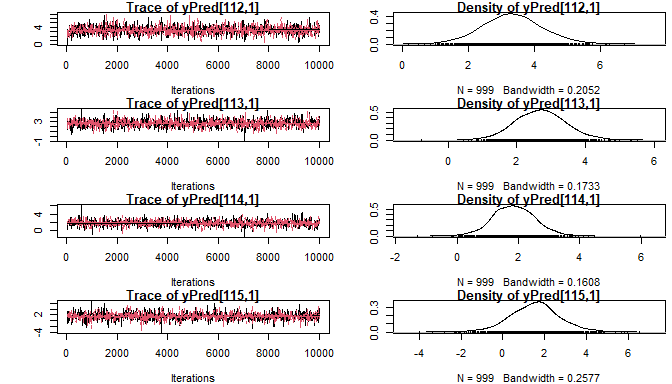

The chains appear to have converged to stationary distributions. We can therefore proceed and calculate summary statistics. The `summary_NSD` function calculates the usual `coda::summary.mcmc` summary, along with matrices of predictions and lower and upper 95% credible interval bounds, with the structure shown below:

```{r modelSummary1}
summary.model1 <- summary_NSD(model1)
str(summary.model1)
```

Let us plot the predictions over the data for in situ location 6:

```{r modelPlot1, fig.width=7, fig.height=4}
par(mar=c(4,4.5,1.25,0.5))
plot(ISdata[, 6] ~ months.balaton, type = "o", pch = 16, col = "grey", xlab = "Year", 
     ylab = "Data value", ylim = c(min(c(ISdata[, 6], summary.model1$lwrbnd.mat[, 1]), 
                                       na.rm = TRUE), 
                                   max(c(ISdata[, 6], summary.model1$uprbnd.mat[, 1]), 
                                       na.rm = TRUE)), bty = "n", 
     main = "Predictions for in situ location 6, for B-spline dimension 41 basis")
lines(summary.model1$pred.mat[, 1] ~ months.balaton)
lines(summary.model1$lwrbnd.mat[, 1] ~ months.balaton, lty = 2)
lines(summary.model1$uprbnd.mat[, 1] ~ months.balaton, lty = 2)
legend("topright", legend = c("In situ data", "Predictions", "95% credible interval bounds"), 
       pch = c(16, NA, NA), lty = c(1, 1, 2), col = c("grey", "black", "black"), 
       horiz = FALSE, bty = "o")
```
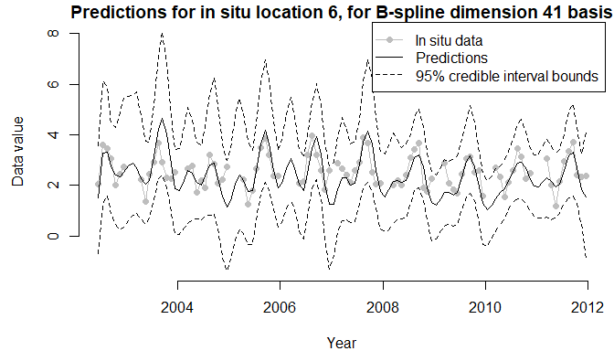

This plot shows that the method is working, but some of the credible intervals are quite wide. Maybe a Fourier basis is more appropriate for these data. Let's refit the model with a Fourier basis of dimension 9, with period 1 year, and reproduce the plots:

```{r model2, fig.width=7, fig.height=4}
model2 <- run.NSDmodel(nIter = 10000, yData = ISdata[, -6], xData = RSdata[, which.closest[-6]],
                       xPred = RSdata[, which.closest[6]], coordsData = coords.IS[-6, ],
                       coordsPred = coords.IS[6, ], times.yData = months.balaton, 
                       times.xData = months.balaton, times.xPred = months.balaton,
                       times.yPred = months.balaton, basis.type = "fourier", basis.dim = 9, 
                       period = 1)
par(mar=c(4,4.5,1,0.5))
plot(model2[, 441:444])
```
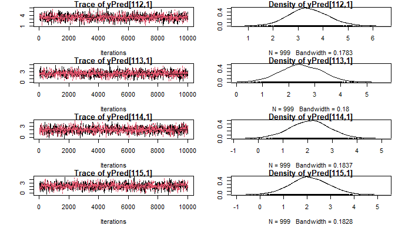

```
summary.model2 <- summary_NSD(model2)
par(mar=c(4,4.5,1.25,0.5))
plot(ISdata[, 6] ~ months.balaton, type = "o", pch = 16, col = "grey", xlab = "Year", 
     ylab = "Data value", ylim = c(min(c(ISdata[, 6], summary.model2$lwrbnd.mat[, 1]), 
                                       na.rm = TRUE), 
                                   max(c(ISdata[, 6], summary.model2$uprbnd.mat[, 1]), 
                                       na.rm = TRUE)), bty = "n",
     main = "Predictions for in situ location 6, for Fourier dimension 9 basis")
lines(summary.model2$pred.mat[, 1] ~ months.balaton)
lines(summary.model2$lwrbnd.mat[, 1] ~ months.balaton, lty = 2)
lines(summary.model2$uprbnd.mat[, 1] ~ months.balaton, lty = 2)
legend("topright", legend = c("In situ data", "Predictions", "95% credible interval bounds"), 
       pch = c(16, NA, NA), lty = c(1, 1, 2), col = c("grey", "black", "black"), 
       horiz = FALSE, bty = "o")
```
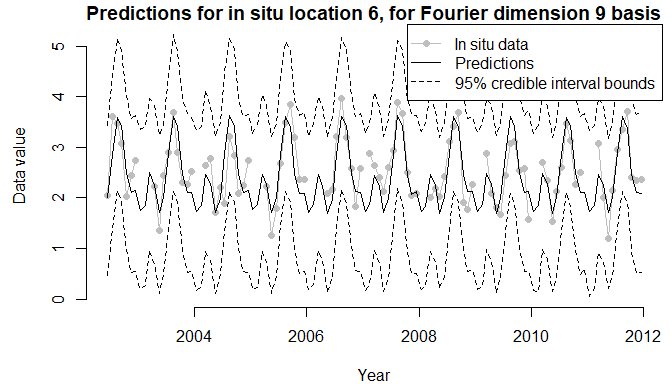

The Fourier basis is able to share information over the years to obtain a better fit. This will only be the case where there is a fairly consistent seasonal pattern over the years. Otherwise, a B-spline basis is preferable.

Let us predict over space. We need to re-run the model and specify where we want to predict. To efficiently predict across space while retaining computational complexity, we can select a set of points that cover the spatial region of interest. In Wilkie et al. (2019), a constrained Delaunay triangulation was carried out to obtain 997 prediction locations covering the region of interest, using the `RTriangle` R package:

```{r delauney1, fig.width=7, fig.height=3.25}
data("which.closest.RS")
par(mar=c(4,4.5,1,0.5))
plot(coords.RS, pch = 15, cex = 0.25, col = "grey", xlab = "Longitude (degrees East)", 
     ylab = "Latitude (degrees North)", bty = "n")
points(coords.RS[which.closest.RS, ], pch = 16, col = "dodgerblue")
legend("topleft", legend = c("Satellite data locations", "Prediction locations"), 
       pch = c(15, 16), pt.cex = c(0.25, 1), col = c("grey", "dodgerblue"), bty = "n")
```
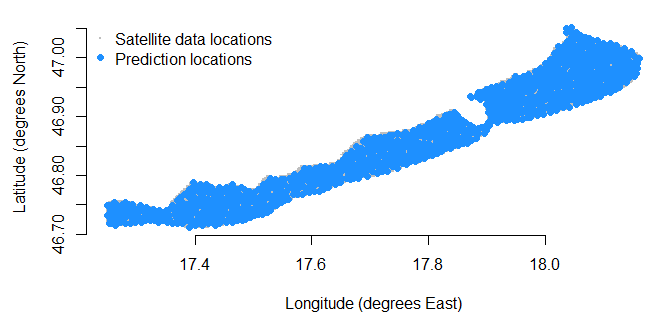

We now re-run the model, again using the Fourier dimension 9 basis with period 1 year, but using data for all in situ locations and predicting at the 997 prediction locations. We also set the number of MCMC iterations to just 100, since this takes a while to run, but note that this is only for illustration purposes and as long a run as necessary must be completed to ensure convergence.

```{r model3, fig.width=7, fig.height=6}
model3 <- run.NSDmodel(nIter = 100, yData = ISdata, xData = RSdata[, which.closest],
                       xPred = RSdata[, which.closest.RS], coordsData = coords.IS,
                       coordsPred = coords.RS[which.closest.RS, ], times.yData = months.balaton, 
                       times.xData = months.balaton, times.xPred = months.balaton,
                       times.yPred = months.balaton, basis.type = "fourier", basis.dim = 9, 
                       period = 1)
summary.model3 <- summary_NSD(model3)
pred.spatial.month102 <- cbind.data.frame(lon = c(coords.RS[which.closest.RS, 1], coords.IS[, 1]),
                                          lat = c(coords.RS[which.closest.RS, 2], coords.IS[, 2]),
                                          data = c(summary.model3$pred.mat[102, ], ISdata[102, ]))
sp::coordinates(pred.spatial.month102) <- c("lon", "lat")
cuts <- seq(from = min(c(unlist(data.spatial.month102@data), unlist(pred.spatial.month102@data), 
                         ISdata), na.rm = TRUE),
            to = max(c(unlist(data.spatial.month102@data), unlist(pred.spatial.month102@data), 
                       ISdata), na.rm = TRUE),
            length.out = 100)
sp.data <- sp::spplot(data.spatial.month102, colorkey = TRUE, pch = 16, 
                      cex=c(rep(0.5, 7616), rep(1, 9)), col.regions = rev(viridis::viridis(100)), 
                      sp.layout = list("sp.points", locations.insitu, pch = 1, 
                                       col = "white", cex = 1.25), scales = list(draw = TRUE), 
                      xlab = "Longitude (degrees East)", ylab = "Latitude (degrees North)", 
                      cuts = cuts, main = "Data for month 102")

sp.pred <- sp::spplot(pred.spatial.month102, colorkey = TRUE, pch = 16, 
                      cex = 1, col.regions = rev(viridis::viridis(100)), 
                      sp.layout = list("sp.points", locations.insitu, pch = 1, 
                                       col = "white", cex = 1.25), scales = list(draw = TRUE), 
                      xlab = "Longitude (degrees East)", ylab = "Latitude (degrees North)", 
                      cuts = cuts, main = "Predictions for month 102")
plot(sp.data, position = c(0, 0.5, 1, 1), more = TRUE)
plot(sp.pred, position = c(0, 0, 1, 0.5), more = FALSE)
```
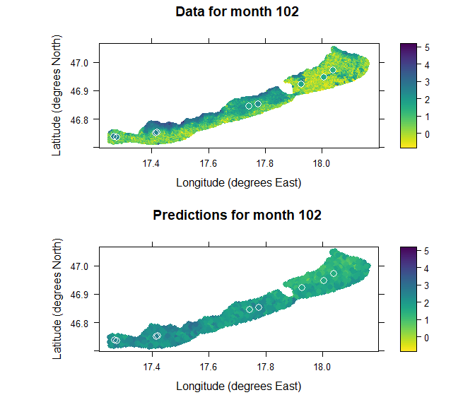

The satellite data and predictions are plotted above, with the in situ data overlaid, surrounded by white circles.

We can also plot the predictions with the 95% credible interval bounds:

```{r model3Bounds, fig.width=7, fig.height=9}
pred2.spatial.month102 <- cbind.data.frame(lon = c(coords.RS[which.closest.RS, 1]),
                                           lat = c(coords.RS[which.closest.RS, 2]),
                                           data = c(summary.model3$pred.mat[102, ]))
sp::coordinates(pred2.spatial.month102) <- c("lon", "lat")
lwrbnd.spatial.month102 <- cbind.data.frame(lon = c(coords.RS[which.closest.RS, 1]),
                                            lat = c(coords.RS[which.closest.RS, 2]),
                                            data = c(summary.model3$lwrbnd.mat[102, ]))
sp::coordinates(lwrbnd.spatial.month102) <- c("lon", "lat")
uprbnd.spatial.month102 <- cbind.data.frame(lon = c(coords.RS[which.closest.RS, 1]),
                                            lat = c(coords.RS[which.closest.RS, 2]),
                                            data = c(summary.model3$uprbnd.mat[102, ]))
sp::coordinates(uprbnd.spatial.month102) <- c("lon", "lat")

cuts2 <- seq(from = min(c(unlist(pred2.spatial.month102@data), 
                          unlist(lwrbnd.spatial.month102@data), 
                          unlist(uprbnd.spatial.month102@data)), na.rm = TRUE),
             to = max(c(unlist(pred2.spatial.month102@data), 
                          unlist(lwrbnd.spatial.month102@data), 
                          unlist(uprbnd.spatial.month102@data)), na.rm = TRUE),
             length.out = 100)
sp.pred2 <- sp::spplot(pred2.spatial.month102, colorkey = TRUE, pch = 16, 
                       cex = 1, col.regions = rev(viridis::viridis(100)), 
                       scales = list(draw = TRUE), xlab = "Longitude (degrees East)", 
                       ylab = "Latitude (degrees North)", cuts = cuts2, 
                       main = "Predictions for month 102")
sp.lwrbnd <- sp::spplot(lwrbnd.spatial.month102, colorkey = TRUE, pch = 16, 
                        cex = 1, col.regions = rev(viridis::viridis(100)), 
                        scales = list(draw = TRUE), xlab = "Longitude (degrees East)", 
                        ylab = "Latitude (degrees North)", cuts = cuts2,
                        main = "95% credible interval lower bound for month 102")
sp.uprbnd <- sp::spplot(uprbnd.spatial.month102, colorkey = TRUE, pch = 16, 
                        cex = 1, col.regions = rev(viridis::viridis(100)), 
                        scales = list(draw = TRUE), xlab = "Longitude (degrees East)", 
                        ylab = "Latitude (degrees North)", cuts = cuts2,
                        main = "95% credible interval upper bound for month 102")
plot(sp.pred2, position = c(0, 0.66, 1, 0.99), more = TRUE)
plot(sp.lwrbnd, position = c(0, 0.33, 1, 0.66), more = TRUE)
plot(sp.uprbnd, position = c(0, 0, 1, 0.33), more = FALSE)
```
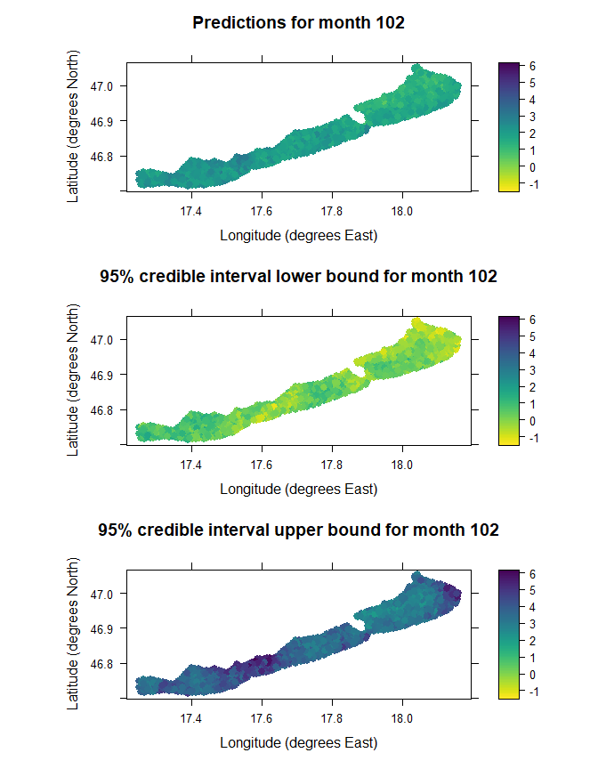

# References

## Methodology:

[Wilkie, C.J., C.A. Miller, E.M. Scott, R.A. O'Donnell, P.D. Hunter, E. Spyrakos and A.N. Tyler (2019). Nonparametric statistical downscaling for the fusion of data of different spatiotemporal support. Environmetrics 30(3):e2549.](https://doi.org/10.1002/env.2549)

## R packages:

[coda](https://cran.r-project.org/package=coda), [fda](https://cran.r-project.org/package=fda), [lubridate](https://cran.r-project.org/package=lubridate), [Rcpp](https://cran.r-project.org/package=Rcpp), [RcppArmadillo](https://cran.r-project.org/package=RcppArmadillo), [RTriangle](https://cran.r-project.org/package=RTriangle), [sp](https://cran.r-project.org/package=sp), [viridis](https://cran.r-project.org/package=viridis)
