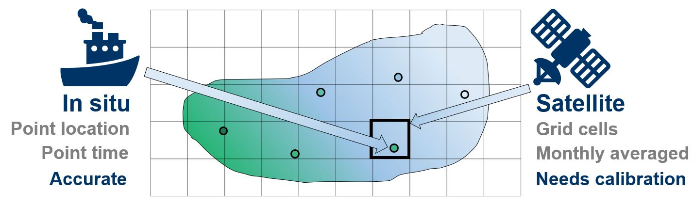

```{r, include = FALSE}
knitr::opts_chunk$set(
  collapse = TRUE,
  comment = "#>"
)
```

NSD is an R package for fusing datasets of different spatiotemporal support using nonparametric statistical downscaling, with:

* **Response dataset:** Low resolution dataset that is assumed to be accurate within measurement error, e.g. in situ samples collected at a small number of point locations at some point times.
* **Covariate dataset:** Higher resolution dataset providing more information on spatiotemporal patterns of a variable, but that requires calibration, e.g. satellite remote sensing data on a dense grid cell scale, averaged over each month.

NSD allows fusing these datasets to retain the spatiotemporal information from the covariate dataset, with the accuracy of the response dataset.

```{r, echo=FALSE, out.width = "600px"}

```

*Figure 1:* Example application of NSD to fuse in situ (response) and satellite (covariate) water quality datasets.

**NEW** in NSD version 0.0.0.9001: Fusing of a response and two covariates is allowed using the function `run.NSDmodelMulti`.

# Data required:

To use the package, you need at least:

* Response dataset: either a matrix or data frame with *q* rows representing times of data collection and *n* columns representing point locations of data collection. Missing values are allowed.
* Covariate dataset: matrix or data frame with *p* rows representing times (or mid points of temporal average intervals) and *n* columns representing the grid cell centres that each response point lies within. Missing values are allowed.
* A matrix of coordinates of response data locations.
* A matrix of coordinates at which to predict.

Note that the response and covariate datasets can also be provided in the form of lists, both of length *n*, where each item in each list is a numeric vector of data values for that location (each potentially of different lengths, depending on when data are available for each location). Missing values should be avoided in the case where the datasets are provided as lists.

It is highly recommended to also provide the times at which data are collected, either in the form of Date vectors (or numeric vectors, e.g. in the form year.proportionOfYear) of length *q* for the response data and of length *p* for the covariate data (where *q* and *p* might be the same), or in the form of a lists of length *n* where each member is a Date vector (or numeric vector) of length equal to the corresponding data provided as a list too.

# Choices required:

## Basis type and dimension

There are lots of adjustments to the default behaviour that can be made, but the biggest choices are the basis type and dimension. NSD fuses the data by treating data at each location as observations of smooth functions, accomplished by using basis functions. The default is to use B-spline bases of dimension 5 for the data at each location, but a more appropriate choice can usually be made from either prior knowledge of the processes at work, or by plotting the response or covariate data over time. Note that the same basis type and dimension must be used for both the response and covariate data.

## Spatial decay parameters

The spatial aspect of the data fusion is accomplished through spatially varying coefficients regression, using an exponential spatial covariance for the spatially varying intercept and slope parameters. The spatial decay parameters of the exponential spatial covariance therefore must be chosen. These are both set as 0.1 by default, but a more appropriate choice can usually be made.

Both the basis dimension and spatial decay parameter choices can be made via a cross validation process, or similar.

## MCMC iterations

The final main choice to make relates to the MCMC process used to fit the Bayesian hierarchical model of NSD. By default, the number of chains is 2, with a short burn-in, some thinning and a small number of MCMC iterations. The iterations should be increased until the chains appear to reach convergence to a stationary distribution according to diagnostic checks.

# Simple example

Let us work through a simple example using water quality data provided by the package.

## Data read-in and manipulation:

```{r init1}
library(NSD)

data("ISdata")
data("RSdata")
data("coords.IS")
data("coords.RS")
data("months.balaton")

class(ISdata); dim(ISdata)
class(RSdata); dim(RSdata)
class(coords.IS); dim(coords.IS)
class(coords.RS); dim(coords.RS)
class(months.balaton); length(months.balaton)
```

`ISdata` is the 115 by 9 matrix of response data, which is a dataset of in situ water quality data collected at 9 point locations over 115 months. `RSdata` is the 115 by 7616 matrix of covariate data, which is a dataset of satellite data for the same variable, collected over the same 115 months, for 7616 grid cells covering the entire lake. `coords.IS` and `coords.RS` are the 9 by 2 and 7616 by 2 matrices of coordinates of in situ and satellite data, respectively. `months.balaton` is the 115-length Date vector of dates at the centre of each month. (In this case, the response and covariate data have the same times of data collection, but this need not be the case to use the NSD package.)

We need to know which satellite grid cells each in situ point location lies within. Let us calculate this using the `sp::spDistsN1` function:

```{r spDists}
which.closest <- numeric(nrow(coords.IS))
for(i in 1:nrow(coords.IS)){
  which.closest[i] <- which.min(sp::spDistsN1(coords.RS, coords.IS[i, ]))
}
which.closest
```

## Plots of the data

Let us produce some simple plots of the data. We can first examine the spatial extent of the data and check that we have calculated the closest grid cells to each point location correctly:

```{r plots1, fig.width=7, fig.height=3.25}
par(mar=c(4,4.5,1,0.5))
plot(coords.RS, pch = 15, cex = 0.25, col = "grey", xlab = "Longitude (degrees East)", 
     ylab = "Latitude (degrees North)", bty = "n")
points(coords.IS, pch = 16, col = "dodgerblue")
points(coords.RS[which.closest, ], pch = 4, col = "red")
legend("topleft", legend = c("Satellite grid cell centres", "In situ point locations", 
                             "Closest grid cells to point locations"), pch = c(15, 16, 4), 
       pt.cex = c(0.25, 1, 1), col = c("grey", "dodgerblue", "red"), bty = "n")
```

Let us plot the data over time for a single in situ point location and the satellite data for its corresponding grid cell:

```{r plots2, fig.width=7, fig.height=3.5}
par(mar=c(4,4.5,1,0.5))
plot(ISdata[, 6] ~ months.balaton, type = "o", pch = 16, col = "grey", xlab = "Year", 
     ylab = "Data value", ylim = c(min(c(ISdata[, 6], RSdata[, which.closest[6]]), 
                                       na.rm = TRUE), 
                                   max(c(ISdata[, 6], RSdata[, which.closest[6]]), 
                                       na.rm = TRUE)), bty = "n")
lines(RSdata[, which.closest[6]] ~ months.balaton, pch = 15, col= "deepskyblue", lty = 2)
legend("topright", legend = c("In situ data", "Satellite data"), pch = c(16, NA), 
       lty = c(1, 2), col = c("grey", "deepskyblue"), horiz = TRUE, bty = "n")
```

There are clear patterns of 2 peaks per year in both datasets, but there is much higher variability in the satellite data, showing the need for calibration with the in situ data.

Let us plot the data over space for a single time point. Adding the in situ data last in the data frame below means that they are plotted last, over the satellite data, allowing us to compare the in situ data to their surrounding satellite data:

```{r plots3, fig.width=7, fig.height=4}
data.spatial.month102 <- cbind.data.frame(lon = c(coords.RS[, 1], coords.IS[, 1]),
                                        lat = c(coords.RS[, 2], coords.IS[, 2]),
                                        data = c(RSdata[102, ], ISdata[102, ]))
sp::coordinates(data.spatial.month102) <- c("lon", "lat")
locations.insitu <- cbind.data.frame(lon = coords.IS[, 1], lat = coords.IS[, 2])
sp::coordinates(locations.insitu) <- c("lon", "lat")
sp::spplot(data.spatial.month102, colorkey = TRUE, pch = 16, 
           cex=c(rep(0.5, 7616), rep(1, 9)), col.regions = rev(viridis::viridis(100)), 
           sp.layout = list("sp.points", locations.insitu, pch = 1, 
                            col = "white", cex = 1.25), scales = list(draw = TRUE), 
           xlab = "Longitude (degrees East)", ylab = "Latitude (degrees North)")
```

The in situ data locations are shown surrounded by white circles. The spatial patterns of the satellite data are clear and would not be understood from the in situ data alone, but the in situ data are clearly slightly higher than their nearby satellite data cells on average, showing the need for calibration.

Let us now fit the model and fuse the datasets.

## Fitting the nonparametric statistical downscaling model

We have the response dataset `ISdata`, the covariate dataset `RSdata`, the matrix of data locations `coords.IS` and the vector `which.closest` that tells us which grid cell each response point location lies within. We also have the vector of dates of data collection `months.balaton`. A simple example is to fit the model to data for all locations except in situ location 6 and then predict at that location for the same times as the data. Let us select a B-spline basis of dimension 41 and let us increase the number of MCMC iterations from the default 100 to 10,000:

```{r model1}
model1 <- run.NSDmodel(nIter = 10000, yData = ISdata[, -6], xData = RSdata[, which.closest[-6]],
                       xPred = RSdata[, which.closest[6]], coordsData = coords.IS[-6, ],
                       coordsPred = coords.IS[6, ], times.yData = months.balaton, 
                       times.xData = months.balaton, times.xPred = months.balaton,
                       times.yPred = months.balaton, basis.type = "bspline", basis.dim = 41)
```

We should check for convergence. In reality, this should be done for many parameters, but here is an illustration for predictions at times 112 to 115:

```{r modelAssess1, fig.width=7, fig.height=4}
par(mar=c(4,4.5,1,0.5))
plot(model1[, 1593:1596])
```

The chains appear to have converged to stationary distributions. We can therefore proceed and calculate summary statistics. The `summary_NSD` function calculates the usual `coda::summary.mcmc` summary, along with matrices of predictions and lower and upper 95% credible interval bounds, with the structure shown below:

```{r modelSummary1}
summary.model1 <- summary_NSD(model1)
str(summary.model1)
```

Let us plot the predictions over the data for in situ location 6:

```{r modelPlot1, fig.width=7, fig.height=4}
par(mar=c(4,4.5,1.25,0.5))
plot(ISdata[, 6] ~ months.balaton, type = "o", pch = 16, col = "grey", xlab = "Year", 
     ylab = "Data value", ylim = c(min(c(ISdata[, 6], summary.model1$lwrbnd.mat[, 1]), 
                                       na.rm = TRUE), 
                                   max(c(ISdata[, 6], summary.model1$uprbnd.mat[, 1]), 
                                       na.rm = TRUE)), bty = "n", 
     main = "Predictions for in situ location 6, for B-spline dimension 41 basis")
lines(summary.model1$pred.mat[, 1] ~ months.balaton)
lines(summary.model1$lwrbnd.mat[, 1] ~ months.balaton, lty = 2)
lines(summary.model1$uprbnd.mat[, 1] ~ months.balaton, lty = 2)
legend("topright", legend = c("In situ data", "Predictions", "95% credible interval bounds"), 
       pch = c(16, NA, NA), lty = c(1, 1, 2), col = c("grey", "black", "black"), 
       horiz = FALSE, bty = "o")
```

This plot shows that the method is working, but some of the credible intervals are quite wide. Maybe a Fourier basis is more appropriate for these data. Let's refit the model with a Fourier basis of dimension 9, with period 1 year, and reproduce the plots:

```{r model2, fig.width=7, fig.height=4}
model2 <- run.NSDmodel(nIter = 10000, yData = ISdata[, -6], xData = RSdata[, which.closest[-6]],
                       xPred = RSdata[, which.closest[6]], coordsData = coords.IS[-6, ],
                       coordsPred = coords.IS[6, ], times.yData = months.balaton, 
                       times.xData = months.balaton, times.xPred = months.balaton,
                       times.yPred = months.balaton, basis.type = "fourier", basis.dim = 9, 
                       period = 1)
par(mar=c(4,4.5,1,0.5))
plot(model2[, 441:444])
summary.model2 <- summary_NSD(model2)
par(mar=c(4,4.5,1.25,0.5))
plot(ISdata[, 6] ~ months.balaton, type = "o", pch = 16, col = "grey", xlab = "Year", 
     ylab = "Data value", ylim = c(min(c(ISdata[, 6], summary.model2$lwrbnd.mat[, 1]), 
                                       na.rm = TRUE), 
                                   max(c(ISdata[, 6], summary.model2$uprbnd.mat[, 1]), 
                                       na.rm = TRUE)), bty = "n",
     main = "Predictions for in situ location 6, for Fourier dimension 9 basis")
lines(summary.model2$pred.mat[, 1] ~ months.balaton)
lines(summary.model2$lwrbnd.mat[, 1] ~ months.balaton, lty = 2)
lines(summary.model2$uprbnd.mat[, 1] ~ months.balaton, lty = 2)
legend("topright", legend = c("In situ data", "Predictions", "95% credible interval bounds"), 
       pch = c(16, NA, NA), lty = c(1, 1, 2), col = c("grey", "black", "black"), 
       horiz = FALSE, bty = "o")
```

The Fourier basis is able to share information over the years to obtain a better fit. This will only be the case where there is a fairly consistent seasonal pattern over the years. Otherwise, a B-spline basis is preferable.

Let us predict over space. We need to re-run the model and specify where we want to predict. To efficiently predict across space while retaining computational complexity, we can select a set of points that cover the spatial region of interest. In Wilkie et al. (2019), a constrained Delaunay triangulation was carried out to obtain 997 prediction locations covering the region of interest, using the `RTriangle` R package:

```{r delauney1, fig.width=7, fig.height=3.25}
data("which.closest.RS")
par(mar=c(4,4.5,1,0.5))
plot(coords.RS, pch = 15, cex = 0.25, col = "grey", xlab = "Longitude (degrees East)", 
     ylab = "Latitude (degrees North)", bty = "n")
points(coords.RS[which.closest.RS, ], pch = 16, col = "dodgerblue")
legend("topleft", legend = c("Satellite data locations", "Prediction locations"), 
       pch = c(15, 16), pt.cex = c(0.25, 1), col = c("grey", "dodgerblue"), bty = "n")
```

We now re-run the model, again using the Fourier dimension 9 basis with period 1 year, but using data for all in situ locations and predicting at the 997 prediction locations. We also set the number of MCMC iterations to just 100, since this takes a while to run, but note that this is only for illustration purposes and as long a run as necessary must be completed to ensure convergence.

```{r model3, fig.width=7, fig.height=6}
model3 <- run.NSDmodel(nIter = 100, yData = ISdata, xData = RSdata[, which.closest],
                       xPred = RSdata[, which.closest.RS], coordsData = coords.IS,
                       coordsPred = coords.RS[which.closest.RS, ], times.yData = months.balaton, 
                       times.xData = months.balaton, times.xPred = months.balaton,
                       times.yPred = months.balaton, basis.type = "fourier", basis.dim = 9, 
                       period = 1)
summary.model3 <- summary_NSD(model3)
pred.spatial.month102 <- cbind.data.frame(lon = c(coords.RS[which.closest.RS, 1], coords.IS[, 1]),
                                          lat = c(coords.RS[which.closest.RS, 2], coords.IS[, 2]),
                                          data = c(summary.model3$pred.mat[102, ], ISdata[102, ]))
sp::coordinates(pred.spatial.month102) <- c("lon", "lat")
cuts <- seq(from = min(c(unlist(data.spatial.month102@data), unlist(pred.spatial.month102@data), 
                         ISdata), na.rm = TRUE),
            to = max(c(unlist(data.spatial.month102@data), unlist(pred.spatial.month102@data), 
                       ISdata), na.rm = TRUE),
            length.out = 100)
sp.data <- sp::spplot(data.spatial.month102, colorkey = TRUE, pch = 16, 
                      cex=c(rep(0.5, 7616), rep(1, 9)), col.regions = rev(viridis::viridis(100)), 
                      sp.layout = list("sp.points", locations.insitu, pch = 1, 
                                       col = "white", cex = 1.25), scales = list(draw = TRUE), 
                      xlab = "Longitude (degrees East)", ylab = "Latitude (degrees North)", 
                      cuts = cuts, main = "Data for month 102")

sp.pred <- sp::spplot(pred.spatial.month102, colorkey = TRUE, pch = 16, 
                      cex = 1, col.regions = rev(viridis::viridis(100)), 
                      sp.layout = list("sp.points", locations.insitu, pch = 1, 
                                       col = "white", cex = 1.25), scales = list(draw = TRUE), 
                      xlab = "Longitude (degrees East)", ylab = "Latitude (degrees North)", 
                      cuts = cuts, main = "Predictions for month 102")
plot(sp.data, position = c(0, 0.5, 1, 1), more = TRUE)
plot(sp.pred, position = c(0, 0, 1, 0.5), more = FALSE)
```

The satellite data and predictions are plotted above, with the in situ data overlaid, surrounded by white circles.

We can also plot the predictions with the 95% credible interval bounds:

```{r model3Bounds, fig.width=7, fig.height=9}
pred2.spatial.month102 <- cbind.data.frame(lon = c(coords.RS[which.closest.RS, 1]),
                                           lat = c(coords.RS[which.closest.RS, 2]),
                                           data = c(summary.model3$pred.mat[102, ]))
sp::coordinates(pred2.spatial.month102) <- c("lon", "lat")
lwrbnd.spatial.month102 <- cbind.data.frame(lon = c(coords.RS[which.closest.RS, 1]),
                                            lat = c(coords.RS[which.closest.RS, 2]),
                                            data = c(summary.model3$lwrbnd.mat[102, ]))
sp::coordinates(lwrbnd.spatial.month102) <- c("lon", "lat")
uprbnd.spatial.month102 <- cbind.data.frame(lon = c(coords.RS[which.closest.RS, 1]),
                                            lat = c(coords.RS[which.closest.RS, 2]),
                                            data = c(summary.model3$uprbnd.mat[102, ]))
sp::coordinates(uprbnd.spatial.month102) <- c("lon", "lat")

cuts2 <- seq(from = min(c(unlist(pred2.spatial.month102@data), 
                          unlist(lwrbnd.spatial.month102@data), 
                          unlist(uprbnd.spatial.month102@data)), na.rm = TRUE),
             to = max(c(unlist(pred2.spatial.month102@data), 
                          unlist(lwrbnd.spatial.month102@data), 
                          unlist(uprbnd.spatial.month102@data)), na.rm = TRUE),
             length.out = 100)
sp.pred2 <- sp::spplot(pred2.spatial.month102, colorkey = TRUE, pch = 16, 
                       cex = 1, col.regions = rev(viridis::viridis(100)), 
                       scales = list(draw = TRUE), xlab = "Longitude (degrees East)", 
                       ylab = "Latitude (degrees North)", cuts = cuts2, 
                       main = "Predictions for month 102")
sp.lwrbnd <- sp::spplot(lwrbnd.spatial.month102, colorkey = TRUE, pch = 16, 
                        cex = 1, col.regions = rev(viridis::viridis(100)), 
                        scales = list(draw = TRUE), xlab = "Longitude (degrees East)", 
                        ylab = "Latitude (degrees North)", cuts = cuts2,
                        main = "95% credible interval lower bound for month 102")
sp.uprbnd <- sp::spplot(uprbnd.spatial.month102, colorkey = TRUE, pch = 16, 
                        cex = 1, col.regions = rev(viridis::viridis(100)), 
                        scales = list(draw = TRUE), xlab = "Longitude (degrees East)", 
                        ylab = "Latitude (degrees North)", cuts = cuts2,
                        main = "95% credible interval upper bound for month 102")
plot(sp.pred2, position = c(0, 0.66, 1, 0.99), more = TRUE)
plot(sp.lwrbnd, position = c(0, 0.33, 1, 0.66), more = TRUE)
plot(sp.uprbnd, position = c(0, 0, 1, 0.33), more = FALSE)
```

# References

## Methodology:

[Wilkie, C.J., C.A. Miller, E.M. Scott, R.A. O'Donnell, P.D. Hunter, E. Spyrakos and A.N. Tyler (2019). Nonparametric statistical downscaling for the fusion of data of different spatiotemporal support. Environmetrics 30(3):e2549.](https://doi.org/10.1002/env.2549)

## R packages:

[coda](https://cran.r-project.org/package=coda), [fda](https://cran.r-project.org/package=fda), [lubridate](https://cran.r-project.org/package=lubridate), [Rcpp](https://cran.r-project.org/package=Rcpp), [RcppArmadillo](https://cran.r-project.org/package=RcppArmadillo), [RTriangle](https://cran.r-project.org/package=RTriangle), [sp](https://cran.r-project.org/package=sp), [viridis](https://cran.r-project.org/package=viridis)


<!-- # Introduction -->

<!-- NSD is an R package for nonparametric statistical downscaling, where the aim is to fuse datasets of different spatiotemporal support. For example, suppose we have a dataset of in-situ samples of water quality data that are available for a small number of point locations at a small number of point times. Suppose also that we have another dataset of remotely-sensed satellite data for the same variable that is available on a dense grid over space and on a monthly-averaged time scale. NSD allows fusing these two datasets to result in a new data product that retains the accuracy of the in-situ data and the higher resolution spatiotemporal information from the satellite data. -->

<!-- # Methodology -->

<!-- The NSD model treats the data for each location for each dataset as observations of smooth functions over time, for both the response (e.g. *in situ* dataset) and the covariate (e.g. the satellite dataset). This is modelled using basis functions. The resulting basis coefficients are related using spatially-varying coefficients regression. This is all achieved within a Bayesian hierarchical model, resulting in the ability to predict at any point in space and time. -->

<!-- More details on the methodology are available in [Wilkie et al. (2019)](https://doi.org/10.1002/env.2549), but to summarise, the model is: -->

<!-- $$\textbf{y}_i|\textbf{c}_i,\sigma_{y}^2 \sim \text{N}_{q_i}(\boldsymbol{\Phi}_i \textbf{c}_i, \sigma_y^2 \textbf{I}_{q_i}),\\ -->
<!-- (\sigma_y^2)^{-1} \sim \text{Ga}(a_y,b_y),\\ -->
<!-- c_{ij}|\alpha_{ij}, \beta_{ij}, d_{ij},\sigma_c^2 \sim \text{N}(\alpha_{ij} + \beta_{ij} d_{ij}, \sigma_c^2),\\ -->
<!-- \boldsymbol{\alpha}_j|\sigma_{\alpha}^2 \sim \text{N}_n(\textbf{0},\sigma_{\alpha}^2 \exp(-\phi_\alpha \textbf{D}_\text{data})),\\ -->
<!-- \boldsymbol{\beta}_{j}|\sigma_{\beta}^2 \sim \text{N}_n(\textbf{1},\sigma_{\beta}^2 \exp(-\phi_\beta \textbf{D}_\text{data})),\\ -->
<!-- (\sigma_{\alpha}^2)^{-1} \sim \text{Ga}(a_\alpha, b_\alpha),\\ -->
<!-- (\sigma_{\beta}^2)^{-1} \sim \text{Ga}(a_\beta, b_\beta),\\ -->
<!-- (\sigma_{c}^2)^{-1} \sim \text{Ga}(a_c, b_c),\\ -->
<!-- \textbf{x}_i| \textbf{d}_i, \sigma_{x}^2 \sim \text{N}_{p_i}(\boldsymbol{\Psi}_{i}\textbf{d}_i, \sigma_{x}^2 \textbf{I}_{p_i}),\\ -->
<!-- (\sigma_{x}^2)^{-1} \sim \text{Ga}(a_x, b_x),$$ -->

<!-- where -->

<!-- * $\textbf{y}_i = (y_{i1},\dots,y_{iq_i})^\text{T}$ is the vector of *in situ* data at point location $i$ ($i=1,\dots,n$) for times 1 to $q_i$. -->
<!-- * $\textbf{x}_i = (x_{i1},\dots,x_{ip_i})^\text{T}$ is the vector of remote sensing data for the grid cell containing point location $i$, for times 1 to $p_i$. Note that the times of the remote sensing data may differ from those of the *in situ* data. -->
<!-- * $n$ is the number of *in situ* data point locations. -->
<!-- * $q_i$ is the number of *in situ* data points collected at point location $i$. -->
<!-- * $p_i$ is the number of remotely-sensed data points collected for grid cell $i$. -->
<!-- * $\boldsymbol{\Phi}_i$ is the ($q_i \times m$) matrix of basis functions evaluated at the $q_i$ times of data collection for $\textbf{y}_i$. -->
<!-- * $\boldsymbol{\Psi}_i$ is the ($p_i \times m$) matrix of basis functions evaluated at the $p_i$ times of data collection for $\textbf{x}_i$. Note that the basis being evaluated here is the same as for $\boldsymbol{\Phi}_i$. -->
<!-- * $m$ is the basis dimension, i.e.\ the number of basis functions in each $\boldsymbol{\Phi}_i$ and $\boldsymbol{\Psi}_i$. -->
<!-- * $\textbf{D}_\text{data}$ is the $(n \times n)$ matrix of distances between the $n$ point locations of the *in situ* data. -->
<!-- * $\phi_\alpha$ and $\phi_\beta$ are the spatial decay parameters that are selected *a priori*. -->
<!-- * $a_y, b_y, a_\alpha, b_\alpha, a_\beta, b_\beta, a_c, b_c, a_x, b_x, \boldsymbol{\mu}_d$ and $\boldsymbol{\Sigma}_d$ are values of hyperparameters, to be chosen *a priori*. Suitable values for $\boldsymbol{\mu}_d$ and $\boldsymbol{\Sigma}_d$ are \textbf{0} and some multiple of $\textbf{I}_m$ respectively, reflecting a lack of knowledge of the signs of the coefficients $\textbf{d}_i$ and of their dependence structure. It is suggested by \cite{BUGS_book} that a small value for each of $a_y, b_y, a_\alpha, b_\alpha, a_\beta, b_\beta, a_c, b_c, a_x$ and  $b_x$, such as $0.001$, leads to noninformative priors. However, \cite{BDA3} note that there is no proper limiting distribution with these values, so that the posterior inferences are sensitive to the values of the coefficients of the prior distribution, implying that this prior is informative. Based upon \cite{sahu2006spatio} and \cite{sahu2010fusing}, a suggestion is instead to set each of $a_y, a_\alpha, a_\beta, a_c$ and $a_x$ equal to 2 and each of $b_y, b_\alpha, b_\beta, b_c$ and $b_x$ equal to 1, so that each of their corresponding prior distributions has mean 1 and infinite variance. -->
<!-- A sensitivity analysis showed that this choice did not affect predictions from the model, but that the posterior distributions of the variance terms displayed high skewness when $\text{Ga}(0.001,0.001)$ prior distributions were used. Therefore, the $\text{Ga}(2,1)$ prior distribution is preferred. -->

<!-- # Using the NSD R package -->

<!-- To use the package, you need to provide at least: -->

<!-- * A matrix or list of response data **Y** (i.e. the dataset that is assumed to be of high accuracy, but might have poor spatial or temporal coverage) -->
<!-- * A matrix or list of covariate data **X** (i.e. the dataset with good spatial or temporal coverage to fuse with the accurate response data) -->

<!-- and: -->

<!-- * A matrix of coordinates of the response data locations -->
<!-- * A matrix of coordinates of the covariate data locations -->

<!-- ## Simple example --- only matrices **Y** and **X** and corresponding coordinates of spatial locations provided, with equally-spaced time points: -->

<!-- Let's get started with a simple example. First, make sure to load the NSD package (if you have not already done so): -->

<!-- ```{r setup} -->
<!-- library(NSD) -->
<!-- ``` -->

<!-- Let's load the example data provided by the package: -->

<!-- ```{r dataReadIn1} -->
<!-- data("ISdata") -->
<!-- data("RSdata") -->

<!-- class(ISdata) -->
<!-- class(RSdata) -->

<!-- dim(ISdata) -->
<!-- dim(RSdata) -->
<!-- ``` -->

<!-- `ISdata` is the dataset of response (i.e. in situ) data for 9 points within a lake, recorded every month for 115 months. `RSdata` is the dataset of covariate (i.e. satellite) data for 7616 grid cells over a lake, also recorded over 115 months. Note that both datasets have timepoints as rows and spatial locations as columns. -->

<!-- Let's also read in the coordinates of each in situ data point and each satellite grid cell, and plot them: -->

<!-- ```{r dataReadIn2,fig.width=7,fig.height=3.5} -->
<!-- data("coords.IS") -->
<!-- data("coords.RS") -->

<!-- class(coords.IS) -->
<!-- class(coords.RS) -->

<!-- dim(coords.IS) -->
<!-- dim(coords.RS) -->

<!-- plot(coords.RS,pch=15,cex=0.25,col="dodgerblue",xlab="Longitude (degrees East)",ylab="Latitude (degrees North)") -->
<!-- points(coords.IS,col="tomato") -->
<!-- legend("topleft",legend=c("coords.RS","coords.IS"),pch=c(15,1),col=c("dodgerblue","tomato"),bty="n") -->
<!-- ``` -->

<!-- Let us plot the remote sensing data for month 106 of 115: -->

<!-- ```{r expl1,fig.width=7,fig.height=3.5} -->
<!-- RSdata.sp <- cbind.data.frame(coords.RS, t(RSdata)) -->
<!-- colnames(RSdata.sp) <- c("lon", "lat", paste0("x.", 1:115)) -->
<!-- sp::coordinates(RSdata.sp) <- c("lon", "lat") -->
<!-- sp::spplot(RSdata.sp, "x.106", col.regions = rev(heat.colors(100)),pch=15,cex=0.5, colorkey = TRUE, -->
<!-- scales = list(draw = TRUE), xlab = "Longitude (degrees East)", -->
<!-- ylab = "Latitude (degrees North)") -->
<!-- ``` -->

<!-- Let's plot the in situ data for location 7, along with the remote sensing data for the grid cell that contains in situ location 7. First, we need to find which grid cells each in situ data point location lies within, for example by using `sp`'s `spDistsN1` function: -->

<!-- ```{r expl2a,fig.width=7,fig.height=3.5} -->
<!-- which.closest <- numeric(ncol(ISdata)) -->
<!-- for(i in 1:ncol(ISdata)){ -->
<!--   which.closest[i] <- which.min(sp::spDistsN1(coords.RS, coords.IS[i, ], longlat = TRUE)) -->
<!-- } -->
<!-- ``` -->

<!-- Now, let's plot the data: -->

<!-- ```{r expl2,fig.width=7,fig.height=3.5} -->
<!-- plot(ISdata[,7],type="l",ylim=c(min(c(ISdata[,7],RSdata[,which.closest[7]]),na.rm=TRUE),max(c(ISdata[,7],RSdata[,which.closest[7]]),na.rm=TRUE)),xlab="Time",ylab="Log(Chlorophyll-a (mg/m^3))") -->
<!-- lines(RSdata[,which.closest[7]],lty=2,col=2) -->
<!-- legend("topleft",legend=c("In situ data for location 7","Remote sensing data for corresponding grid cell"),lty=c(1,2),col=c(1,2),bty="n") -->
<!-- ``` -->

<!-- The remote sensing data are much more variable than the in situ data, but they otherwise generally follow the same patterns. -->

<!-- Let's now fit the model to the data: -->

<!-- ```{r mod1,fig.width=7,fig.height=3.5} -->
<!-- mod1.NSD <- run.NSDmodel(yData = ISdata[, -7], xData = RSdata[, which.closest[-7]], xPred = RSdata[, which.closest[7]],  -->
<!--                          coordsData = coords.IS[-7, ], coordsPred = coords.RS[which.closest[7], ]) -->
<!-- ``` -->

<!-- We get some warnings, since we have not provided any information on the time points for which the data are available. The default behaviour is to treat the data as being equally-spaced over time, with predictions made at the times of the in situ data. Before we move on, we should specify the number of iterations to use, since the default of 100 is almost always far too few. Let us also specify a Fourier basis, with dimension 5 and period 1: -->

<!-- ```{r mod1a,fig.width=7,fig.height=3.5} -->
<!-- mod1.NSD <- run.NSDmodel(yData = ISdata[, -7], xData = RSdata[, which.closest[-7]], xPred = RSdata[, which.closest[7]],  -->
<!--                          coordsData = coords.IS[-7, ], coordsPred = coords.RS[which.closest[7], ], -->
<!--                          nIter = 10000, basis.dim = 41) -->
<!-- ``` -->

<!-- Let us calculate a summary of the model output. Using the function `summary_NSD` calculates a summary of the MCMC chains using `coda`'s `summary.mcmc` function, along with matrices of predictions and their corresponding 95% credible interval bounds: -->

<!-- ```{r mod2,fig.width=7,fig.height=3.5} -->
<!-- summary.mod1.NSD <- summary_NSD(mod1.NSD) -->

<!-- str(summary.mod1.NSD) -->
<!-- ``` -->

<!-- Let's plot the predictions over the data: -->

<!-- ```{r mod3,fig.width=7,fig.height=3.5} -->
<!-- plot(ISdata[,7],type="l",ylim=c(min(c(ISdata[,7],RSdata[,which.closest[7]],summary.mod1.NSD$lwrbnd.mat[,1]),na.rm=TRUE),max(c(ISdata[,7],RSdata[,which.closest[7]],summary.mod1.NSD$uprbnd.mat[,1]),na.rm=TRUE)+2),xlab="Time",ylab="Log(Chlorophyll-a (mg/m^3))") -->
<!-- lines(RSdata[,which.closest[7]],lty=2,col=2) -->
<!-- lines(summary.mod1.NSD$pred.mat[,1],lwd=2,lty=3,col="grey") -->
<!-- lines(summary.mod1.NSD$lwrbnd.mat[,1],lwd=2,lty=3,col="grey") -->
<!-- lines(summary.mod1.NSD$uprbnd.mat[,1],lwd=2,lty=3,col="grey") -->
<!-- legend("topleft",legend=c("In situ data for location 7","Remote sensing data for corresponding grid cell","Predictions and 95% CI bounds"),lty=c(1,2,3),col=c(1,2,"grey"),lwd=c(1,1,2),bty="n") -->
<!-- ``` -->

<!-- It looks like the predictions follow the temporal patterns of the in situ and remotely sensed data, but with much less variability over time than the remotely sensed data. -->

<!-- Maybe we can improve things by using a Fourier basis, which takes account of the seasonality of the data and should be less affected by uncertainties introduced by gaps in the data. To do this, let us also specify the times at which the data are collected. -->

<!-- ## Specifying times: -->

<!-- We have the time points of the data in the dataset `months.balaton`: -->

<!-- ```{r times1,fig.width=7,fig.height=3.5} -->
<!-- data("months.balaton") -->

<!-- str(months.balaton) -->
<!-- c(min(months.balaton),max(months.balaton)) -->
<!-- ``` -->

<!-- We have 115 monthly time points (each corresponding to one row of `ISdata` and `RSdata`), in Date format, from June 2002 to December 2011. -->

<!-- Let us fit the model using a Fourier basis of dimension 5 and period 1, making sure this time to also specify the timepoints for each dataset (which are the same for each in this example): -->

<!-- ```{r modFourier1,fig.width=7,fig.height=3.5} -->
<!-- mod1.Fourier.NSD <- run.NSDmodel(yData = ISdata[, -7], xData = RSdata[, which.closest[-7]], xPred = RSdata[, which.closest[7]],  -->
<!--                          coordsData = coords.IS[-7, ], coordsPred = coords.RS[which.closest[7], ], -->
<!--                          nIter = 10000, basis.type = "fourier", basis.dim = 5, period = 1, -->
<!--                          times.yData = months.balaton, times.xData = months.balaton, times.xPred = months.balaton, times.yPred = months.balaton) -->
<!-- summary.mod1.Fourier.NSD <- summary_NSD(mod1.Fourier.NSD) -->
<!-- plot(ISdata[,7] ~ months.balaton,type="l",ylim=c(min(c(ISdata[,7],RSdata[,which.closest[7]],summary.mod1.NSD$lwrbnd.mat[,1]),na.rm=TRUE),max(c(ISdata[,7],RSdata[,which.closest[7]],summary.mod1.NSD$uprbnd.mat[,1]),na.rm=TRUE)+2),xlab="Time",ylab="Log(Chlorophyll-a (mg/m^3))") -->
<!-- lines(RSdata[,which.closest[7]] ~ months.balaton,lty=2,col=2) -->
<!-- lines(summary.mod1.Fourier.NSD$pred.mat[,1] ~ months.balaton,lwd=2,lty=3,col="grey") -->
<!-- lines(summary.mod1.Fourier.NSD$lwrbnd.mat[,1] ~ months.balaton,lwd=2,lty=3,col="grey") -->
<!-- lines(summary.mod1.Fourier.NSD$uprbnd.mat[,1] ~ months.balaton,lwd=2,lty=3,col="grey") -->
<!-- legend("topleft",legend=c("In situ data for location 7","Remote sensing data for corresponding grid cell","Predictions and 95% CI bounds"),lty=c(1,2,3),col=c(1,2,"grey"),lwd=c(1,1,2),bty="n") -->
<!-- ``` -->


